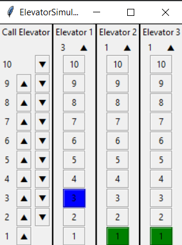

# Simulations

There's so much we need to change with this code; however, here's a short lil guide on how to get it going.

### Quickstart:

* Make sure you are using something that allows GUI, so no Colab or running this in a Docker image (possible, 
but might have to get creative with this option).

* If you haven't already, make sure you are at the `/simulations` directory with the following command:
```
cd simulations
```

* Run the example code in Python:
```
python example.py
```

* The GUI will lag a bit before starting. The following is what your screen should look like when it has loaded the
elevator call:

* When you test this out further, it is good practice to make sure you are using the ```Controller``` class of the ```example_classes``` directory to control elevator movement and elevator calls, since its name is "controller".
